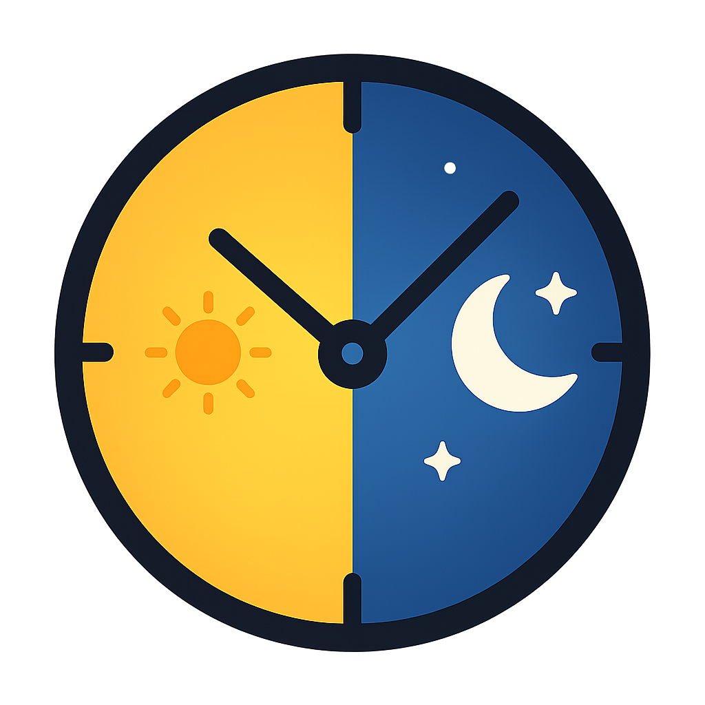

# Auto Theme Switcher

<div >
  
</div>

Une extension VS Code élégante qui change automatiquement le thème de votre éditeur en fonction de l'heure de la journée.

## ✨ Features

- **Automatic switching**: Toggle between light and dark themes based on time
- **Highly configurable**: Customize transition times and themes used
- **Visual indicator**: Status bar icon (☀️ for day, 🌙 for night)
- **Full control**: Easily enable/disable automatic switching
- **Intuitive interface**: Simple configuration via quick commands

## 🚀 Usage

### Available commands

Access commands via `Ctrl+Shift+P` (or `Cmd+Shift+P` on Mac):

- **Auto Theme: Toggle Auto Switch** - Enable or disable the feature
- **Auto Theme: Switch Theme Now** - Force theme change based on current time
- **Auto Theme: Configure Hours and Themes** - Open an interactive configuration menu

### Status bar

Click the icon in the status bar (bottom right) to quickly toggle automatic switching.

- ☀️ Auto Theme - Light theme active
- 🌙 Auto Theme - Dark theme active
- ⏸️ Auto Theme - Feature disabled

## ⚙️ Configuration

Configure the extension via VS Code settings (`settings.json`):

```json
{
  "autoThemeSwitcher.enabled": true,
  "autoThemeSwitcher.lightTheme": "Default Light Modern",
  "autoThemeSwitcher.darkTheme": "Default Dark Modern",
  "autoThemeSwitcher.lightThemeStartHour": 7,
  "autoThemeSwitcher.darkThemeStartHour": 19,
  "autoThemeSwitcher.checkInterval": 5
}
```

### Available settings

| Setting | Type | Default | Description |
|---------|------|---------|-------------|
| `enabled` | boolean | `true` | Enable/disable automatic switching |
| `lightTheme` | string | `"Default Light Modern"` | Theme to use during daytime |
| `darkTheme` | string | `"Default Dark Modern"` | Theme to use during nighttime |
| `lightThemeStartHour` | number | `7` | Light theme start hour (0-23) |
| `darkThemeStartHour` | number | `19` | Dark theme start hour (0-23) |
| `checkInterval` | number | `5` | Check interval in minutes (1-60) |

## 📖 Examples

### Custom configuration

**Early bird developer:**
```json
{
  "autoThemeSwitcher.lightThemeStartHour": 5,
  "autoThemeSwitcher.darkThemeStartHour": 20
}
```

**Night owl developer:**
```json
{
  "autoThemeSwitcher.lightThemeStartHour": 10,
  "autoThemeSwitcher.darkThemeStartHour": 16
}
```

**With custom themes:**
```json
{
  "autoThemeSwitcher.lightTheme": "GitHub Light",
  "autoThemeSwitcher.darkTheme": "One Dark Pro"
}
```

## 🎯 How does it work?

1. The extension checks the current time at regular intervals
2. If the time is between `lightThemeStartHour` and `darkThemeStartHour`, the light theme is applied
3. Otherwise, the dark theme is applied
4. The change only occurs if the current theme is different from the target theme

## 🛠️ Development Installation

1. Clone this repository
2. Install dependencies:
   ```bash
   npm install
   ```
3. Compile the project:
   ```bash
   npm run compile
   ```
4. Press `F5` in VS Code to launch the extension in debug mode

## 📦 Build and Publishing

```bash
# Compile
npm run compile

# Watch mode for development
npm run watch

# Package the extension
npm install -g @vscode/vsce
vsce package
```

## 🤝 Contributing

Contributions are welcome! Feel free to open an issue or pull request.

## 📝 License

MIT

## 🙏 Acknowledgments

Created with simplicity and elegance to enhance your development experience.

---

**Enjoy optimal visual comfort throughout the day! ☀️🌙**


